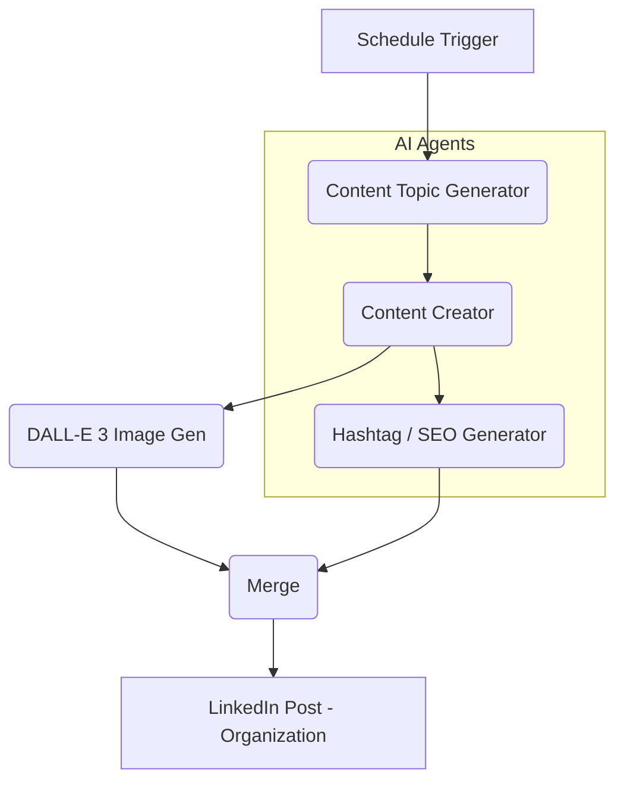
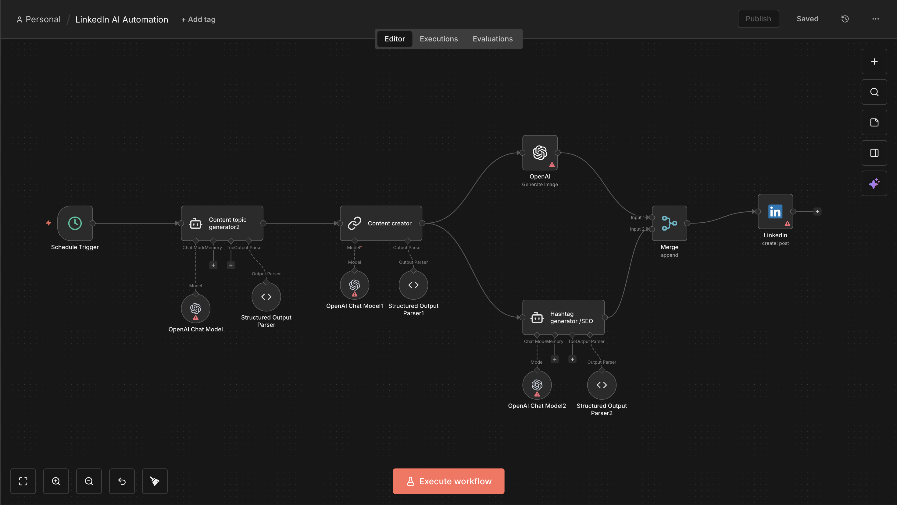

# 🤖 LinkedIn AI Content Automation - Agentic Vibe

> **Elevate your personal brand with an autonomous content engine designed for solopreneurs and AI-first founders.**

This repository contains a high-end **n8n workflow** that automates the entire LinkedIn content lifecycle: from strategic topic generation to creative copywriting, AI image generation, and SEO-optimized posting.

---

## 🌟 Overview

The **LinkedIn AI Content Automation** (Agentic Vibe edition) isn't just a simple bot; it's a multi-agent system built on **LangChain** and **OpenAI**. It thinks like a content strategist, writes like a professional copywriter, and designs like a digital artist.

### 🔄 Workflow Architecture

---

## ✨ Features

-   **🧠 Strategic Topic Generation**: Uses GPT-4o-mini to research and generate high-value content pillars (AI Automation, Solopreneurship, No-code).
-   **✍️ Agentic Copywriting**: Tailored LinkedIn-style hooks and body content that resonates with founders and creators.
-   **🎨 AI Image Synthesis**: Integrates OpenAI's DALL-E to generate realistic, professional visuals for every post.
-   **🔍 SEO & Hashtag Optimization**: Specialized agent for maximizing reach using broad, niche, and trending hashtags.
-   **⏰ 100% Hands-Free**: Scheduled to run every 6 hours (configurable) for consistent digital presence.

---

## 🛠️ Tech Stack

-   **Automation**: [n8n](https://n8n.io/)
-   **Orchestration**: [LangChain](https://js.langchain.com/)
-   **LLMs**: OpenAI GPT-4o-mini
-   **Image Gen**: OpenAI DALL-E 3
-   **Destinations**: LinkedIn API

---

## 🚀 Getting Started

### Prerequisites

1.  An **n8n** instance (Cloud or Self-hosted).
2.  **OpenAI API Key** (with access to DALL-E and GPT models).
3.  **LinkedIn Developer App** (with `w_member_social` or `w_organization_social` permissions).

### Installation

1.  Download the `LinkedIn AI Content Automation.json` file from this repo.
2.  Open your n8n workspace.
3.  Click **Import from File** and select the JSON.
4.  Configure your credentials:
    -   **OpenAI Chat Model**: Add your API Key.
    -   **LinkedIn**: Connect your account via OAuth2.
5.  (Optional) Customize the "Style Guide" in the **Content topic generator** node to match your own voice.
6.  Set the workflow to **Active**.

---

## 📈 Brand Pillars (Agentic Vibe)
The system is pre-configured to focus on:
-   AI for Content & Workflow Automation
-   LinkedIn Growth Strategies
-   Solopreneur Productivity
-   Systems Thinking for Personal Brands
-   The Future of Automated Influence

---

## 📄 License

This project is licensed under the [MIT License](LICENSE).

---

  Generated with ❤️ by <b>Kürşat Ürensü</b>

