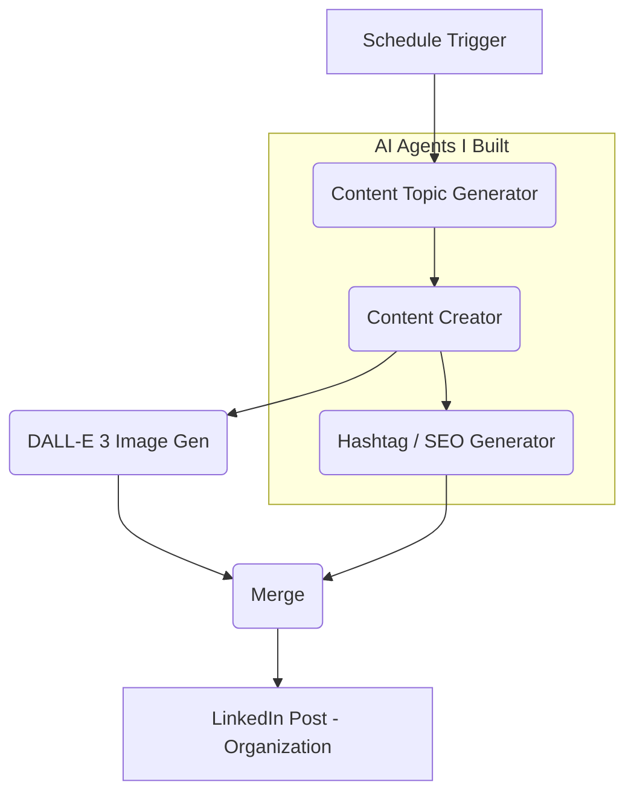

# 🚀 My LinkedIn AI Content Machine - "Agentic Vibe"

> **A project I built to automate my personal brand using a multi-agent AI system.**

Hey! This is a **n8n workflow** I developed to handle the entire LinkedIn content process. I was tired of manual posting and wanted to see if I could build a "brain" that researches, writes, creates images, and posts everything on its own.

---

## 🛠️ How it Works (The Logic)

I used **LangChain** and **OpenAI** to create a pipeline that thinks like a content strategist. It doesn't just spam; it actually follows specific strategic pillars.

### 🔄 Workflow Architecture

---

## 🔥 Cool Features

-   **🧠 Smart Brain (Topic Generation)**: It uses GPT-4o-mini to find cool topics like AI Automation, Solopreneurship, and No-code tools.
-   **✍️ Personal Copywriter**: I customized it to write in a "Founder" voice—confident, sharp, and a bit contrarian.
-   **🎨 Auto-Designer**: It talks to DALL-E 3 to make a realistic, matching image for every post so it doesn't look like generic AI trash.
-   **🔍 Built-in SEO**: It has a specific agent just for hashtags to make sure my posts actually get seen.
-   **⏰ Ultimate Laziness**: I set it to run every 6 hours automatically. Total hands-free growth!

---

## 💻 Tech I Used

-   **Automation**: [n8n](https://n8n.io/) (My favorite tool for this)
-   **Logic**: [LangChain](https://js.langchain.com/)
-   **AI**: OpenAI GPT-4o-mini & DALL-E 3
-   **API**: LinkedIn Developer Platform

---

## 🚀 Want to try it?

### Things you'll need:

1.  An **n8n** instance (I run mine on self-hosted, but cloud works too).
2.  Your **OpenAI API Key**.
3.  A **LinkedIn Developer App** with posting permissions.

### How to set it up:

1.  Download the `LinkedIn AI Content Automation.json` from the `workflow/` folder.
2.  Import it into your n8n.
3.  Add your credentials to the **OpenAI** and **LinkedIn** nodes.
4.  (Optional) Change the "Style Guide" in the **Content topic generator** if you want it to sound like you!
5.  Turn the "Active" switch on and you're good to go.

---

## 📈 Brand Pillars I Focused On
I trained the agents to focus on:
-   AI for Content & Workflow Automation
-   LinkedIn Growth Strategies
-   Solopreneur Productivity
-   Systems Thinking for Personal Brands
-   The Future of Automated Influence

---

## 📄 License

I've put this under the [MIT License](LICENSE), so feel free to use it and build cool stuff!

---

  Built with ❤️ by a student explorer of <b>Agentic Vibe</b>

